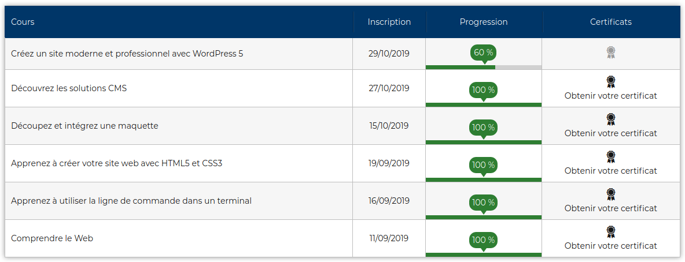

# early_frontend_learnings
The different front end apprenticeships during my training course.

During 2 months before the beginning of my training course(start the 18-11-2019), Iwent on openclasrooms website where I had started to follow the web developer's path (https://openclassrooms.com/fr/paths/185-developpeur-web).
On the following picture, you can see what I have done during this two month: 

You will can find in this repository https://github.com/Yorgamaton/early_frontend_learnings/tree/master/0_openclassrooms_exercises , all the exercises I've done through these classes. 
